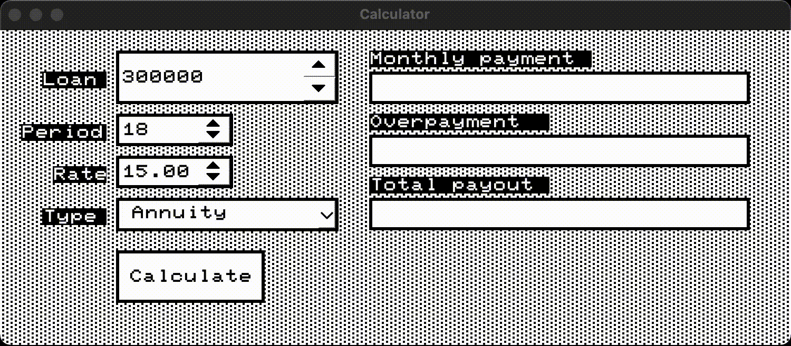

# SmartCalc C++

## Calc mode


Functional:
- arithmetic operations
- trigonometric operations
- insert x
- drawing a graph

## Credit mode


Functional:
- annuity payment mode
- differentiated payment mode
- calculate monthly payment
- calculate overpayment
- calculate total payout

## MVC
The calculator is implemented using the mvc pattern


## OS
- MacOS
- Ubuntu

## Dependencies
- Qt5
- Qt6
- Cmake
- make

## install
```bash
git clone git@github.com:KonstantinAntoniadi/s21_SmartCalc_v2.0.git
cd s21_SmartCalc_v2.0
make install
```

## open
```bash
make open
```
