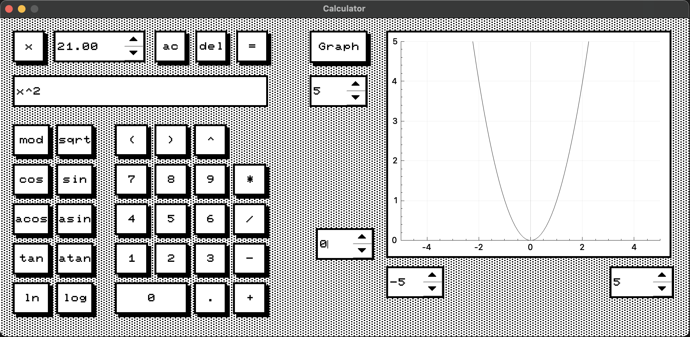

# SmartCalc
> Created by edwinevi  
> School 21 (Kzn)

## _Overview_
### Calc mode


Functional:
- arithmetic operations
- trigonometric operations
- insert x
- drawing a graph

### Credit mode


Functional:
- annuity payment mode
- differentiated payment mode
- calculate monthly payment
- calculate overpayment
- calculate total payout

## OS
- MacOs
## Dependencies
- Qt5
- Qt6
- Cmake
- make

## install
```make install```

## open
```make open```
